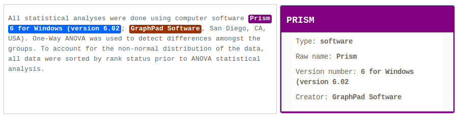

# GROBID software-mentions module

[](http://www.apache.org/licenses/LICENSE-2.0.html)

__Work in progress.__

The goal of this GROBID module is to recognize in textual documents and PDF any mentions of software.   

As the other GROBID models, the module relies only on machine learning and can use linear CRF (via [Wapiti](https://github.com/kermitt2/Wapiti) JNI integration) or Deep Learning model such as BiLSTM-CRF with or without ELMo (via [DeLFT](https://github.com/kermitt2/delft) JNI integration). 

A description of the task and some preliminary evaluations can be found [here](doc/description.md).

## Install, build, run

Building module requires maven and JDK 1.8.  

First install and build the latest development version of GROBID as explained by the [documentation](http://grobid.readthedocs.org).

Copy the module software-mentions as sibling sub-project to grobid-core, grobid-trainer, etc.:

> cp -r software-mentions grobid/

Copy the provided pre-trained model in the standard grobid-home path:

> cd grobid/software-mentions/

> ./gradlew copyModels 

Try compiling everything with:

> ./gradlew clean install 

Run some test: 

> ./gradlew clean test


## Start the service

> ./gradlew clean appRun

Javascript demo/console web app is then accessible at ```http://localhost:8060```. From the console and the `RESTfull services` tab, you can process chunk of text (select `ProcessText`) or process a complete PDF document (select `Annotate PDF document`).




Using ```curl``` POST/GET requests with some text:

```
curl -X POST -d "text=The next step is to install GROBID version 0.5.4." localhost:8060/processSoftwareText
```

which should return this:

```json
{
    "entities": [{
        "software-name": {
            "rawForm": "GROBID",
            "offsetStart": 28,
            "offsetEnd": 34
        },
        "type": "software",
        "version-number": {
            "rawForm": "version 0.5.4",
            "offsetStart": 35,
            "offsetEnd": 48
        }
    }],
    "runtime": 2
}
```

```
curl -GET --data-urlencode "text=The final step is to update GROBID version 0.5.5." localhost:8060/processSoftwareText
```

Using ```curl``` POST/PUT requests with a PDF file:

```bash
curl --form input=@./thefile.pdf localhost:8060/annotateSoftwarePDF
```

Runtimes are expressed in milliseconds. 

## Training and evaluation

### Training only

For training the software model with all the available training data:

```
> cd PATH-TO-GROBID/grobid/software-mentions/

> ./gradlew train_software 
```

The training data must be under ```software-mentions/resources/dataset/software/corpus```. 

### Evaluating only

For evaluating under the labeled data under ```grobid-astro/resources/dataset/software/evaluation```, use the command:

```
>  ./gradlew eval_software [-PgH=/path/grobid/home]
```

The grobid home can be optionally specified with parameter `-PgH`. By default it will take `../grobid-home`  


### Training and evaluating with automatic corpus split

The following commands will split automatically and randomly the available annotated data (under ```resources/dataset/software/corpus/```) into a training set and an evaluation set, train a model based on the first set and launch an evaluation based on the second set. 

```
>  ./gradlew eval_software_split [-PgH=/custom/grobid/home -Ps=0.8 -Pt=10] 
```

In this mode, by default, 90% of the available data is used for training and the remaining for evaluation. This default ratio can be changed with the parameter `-Ps`. By default, the training will use the available number of threads of the machine, but it can also be specified by the parameter `-Pt`.
The grobid home can be optionally specified with parameter `-PgH`. By default it will take `../grobid-home`  


## Training data import

### Assembling the softcite dataset

The source of training data is the [softcite dataset](https://github.com/howisonlab/softcite-dataset) developed by [James Howison](http://james.howison.name/) Lab at the University of Texas at Austin. The data need to be compiled with actual PDF content preliminary to training in order to create XML annotated document (MUC conference style). This is done with the following command which takes 3 arguments: 

```
> ./gradlew annotated_corpus_generator_csv -Ppdf=/path/input/pdf -Pcsv=path/csv -Poutput=/output/directory
```

The path to the PDF repo is the path where the PDF corresponding to the annotated document will be downloaded (done only the first time). For instance:


```
> ./gradlew annotated_corpus_generator_csv -Ppdf=/home/lopez/repository/softcite-dataset/pdf/ -Pcsv=/home/lopez/tools/softcite-dataset/data/csv_dataset/ -Poutput=resources/dataset/software/corpus/
```

The compiled XML training files will be written in the standard GROBID training path for the softwate recognition model under `grobid/software-mentions/resources/dataset/software/corpus/`.

### Inter-Annotator Agreement measures

The import process includes the computation of standard Inter-Annotator Agreement (__IIA__) measures for the documents being annotated by at least two annotators. For the moment, the reported IIA is a percentage agreement measure, with standard error and confidence interval.  

See this nice [tutorial](https://dkpro.github.io/dkpro-statistics/inter-rater-agreement-tutorial.pdf) about IIA. We might need more sophisticated IIA measures than just percentage agreement for more robustness. We plan, in addition to pourcentage agreement, to also cover various IIA metrics from π, κ, and α families using the [dkpro-statistics-agreement](https://dkpro.github.io/dkpro-statistics/) library:

Christian M. Meyer, Margot Mieskes, Christian Stab, and Iryna Gurevych: [DKPro Agreement: An Open-Source Java Library for Measuring Inter-Rater Agreement](https://dkpro.github.io/dkpro-statistics/dkpro-agreement-poster.pdf), in: Proceedings of the 25th International Conference on Computational Linguistics (COLING), pp. 105–109, August 2014. Dublin, Ireland. 

For explanations on these IIA measures, see: 

Artstein, R., & Poesio, M. (2008). [Inter-coder agreement for computational linguistics](https://www.mitpressjournals.org/doi/pdf/10.1162/coli.07-034-R2). Computational Linguistics, 34(4), 555-596.

## Analysis of training data consistency

A Python 3.* script is available under `script/` to analyse XML training data and spot possible unconsistencies to review. To launch the script: 

```
> python3 script/consistency.py _absolute_path_to_training_directory_
```

For instance: 


```
> python3 script/consistency.py /home/lopez/grobid/software-mentions/resources/dataset/software/corpus/
```

See the description of the output directly in the header of the `script/consistency.py` file. 


## Generation of training data

For generating training data in XML/TEI, based on the current model, from a list of text or PDF files in a input repository, use the following command: 

```
> java -Xmx4G -jar target/software-mentions/-0.5.1-SNAPSHOT.onejar.jar -gH ../grobid-home -dIn ~/test_software/ -dOut ~/test_software/out/ -exe createTraining
```


## License

GROBID and the grobid software-mentions module are distributed under [Apache 2.0 license](http://www.apache.org/licenses/LICENSE-2.0). 
