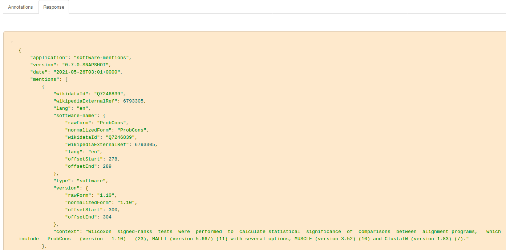
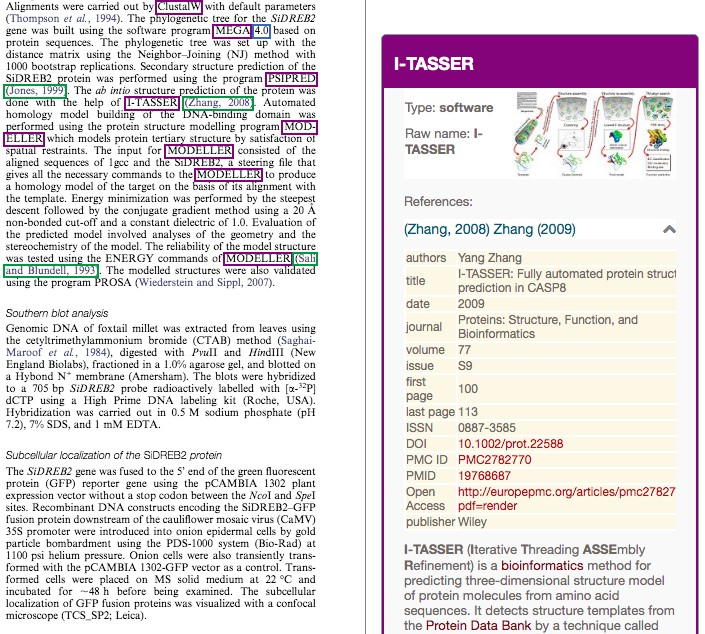
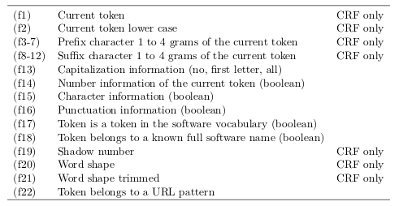
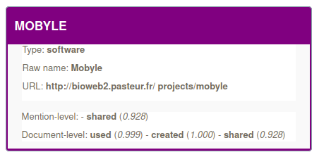

# Softcite software mention recognition service

[](http://www.apache.org/licenses/LICENSE-2.0.html)
[](http://cloud.science-miner.com/software)
[](https://hub.docker.com/r/grobid/software-mentions "Docker Pulls")

The goal of this GROBID module is to recognize any software mentions in scholar textual documents, publisher XML and PDF. It uses as training data the [Softcite Dataset](https://github.com/howisonlab/softcite-dataset) developed by [James Howison](http://james.howison.name/) Lab at the University of Texas at Austin. This annotated corpus and the present software text mining component have been developed supported by a grant from the Alfred P. Sloan foundation to [improve credit for research software](https://blog.ourresearch.org/collaborating-635k-grant-improve-credit-research-software/).

_Code with paper_: the [following article is available in CC-BY](https://github.com/ourresearch/software-mentions/raw/master/doc/afp1085-lopezA-CC-BY.pdf): 

```
Patrice Lopez, Caifan Du, Johanna Cohoon, Karthik Ram, and James Howison. 2021. 
Mining Software Entities in Scientific Literature: Document-level NER for an Extremely Imbalance and Large-scale Task. 
In Proceedings of the 30th ACM International Conference on Information and Knowledge Management (CIKM ’21), 
November 1–5, 2021, QLD, Australia. https://doi.org/10.1145/3459637.3481936
[Best Applied Research Paper Award runner-up]
```

For more recent evaluations and a description of a use case in production to monitor Open Science in France, see:

```
Aricia Bassinet, Laetitia Bracco, Anne L'Hôte, Eric Jeangirard, Patrice Lopez, et al.. Large-scale Machine-Learning analysis of scientific PDF for monitoring the production and the openness of research data and software in France. 2023. ⟨hal-04121339v3⟩
https://hal.science/hal-04121339v3
```

As the other GROBID models, the module relies only on state-of-the-art machine learning. The tool can use linear CRF (via [Wapiti](https://github.com/kermitt2/Wapiti) JNI integration) or Deep Learning model such as BiLSTM-CRF, ELMo or fine-tuned transformers BERT, e.g. SciBERT and LinkBERT (via [DeLFT](https://github.com/kermitt2/delft) JNI integration) and any combination of them. 

Thanks to its integration in the [GROBID](https://github.com/kermitt2/grobid) framework, the software mention extraction on scholar PDF is:

- __structure-aware__: the extraction is realized on the relevant textual zones, skipping for instance figure content, headnotes, formulas, bibliographical reference section, etc. and exploiting the knowledge of inline reference markers, section and paragraph boundaries, etc. for the textual zones

- __robust__: text stream in PDF is recovered and cleaned with various additional process going beyond traditional pdf-to-text low level PDF extraction tool, for instance line number removal, de-hyphenation, unicode character combination, multi-column support, handling of page/figure breaks, unicode normalization, removal of manuscript line numbers, etc. 

- __combined with bibliographical reference recognition__: the bibliographical reference markers possibly used in combination with the software mention are recognized, attached to the software mention when possible, matched with the full bibliographical reference in the bibliographical section of the article and disambiguated against CrossRef and Unpaywall

- __combined with PDF coordinates__: in case the input is a PDF, the bounding boxes of the extracted software mentions, software attributes and attached bibliographical references in the original PDF are provided, in order to create augmented interative PDF to visualize and interact directly with software mentions on the PDF, see the [console demo](https://github.com/ourresearch/software-mentions/#console-web-app)

- __combined with entity disambiguation__: extracted software names are disambiguated in context against software entities in Wikidata via [entity-fishing](https://github.com/kermitt2/entity-fishing)

- __combined with software usage, creation and sharing__ characterizations: based on the different mentions of a software in a document, each mention is classified to estimate if the software is likely used in the research work, a creation part of the research work and if it is publicly shared. A consolidation step then provides at document-level these characterization for each mentioned software.

- __scaling__: as we want to scale to the complete scientific corpus, the process is optimized in runtime and memory usage. We are able to process entirely around 2 PDF per second with the CRF model (including PDF processing and structuring, extractions, bibliographical reference disambiguation against crossref and entity disambiguation against WikiData) on one low/medium cost Ubuntu server, Intel i7-4790 (4 CPU), 4.00 GHz with 16 GB memory. Around 0.5 PDF per second is processed when using the fine-tuned SciBERT model, the best performing model - an additional GPU is however necessary when using Deep Learning models and runtime, depending on the DL architecture of choice.

Latest performance (accuracy and runtime) can be found in the most recent cited publication above, and more model comparisons [below](https://github.com/ourresearch/software-mentions#benchmarking-of-the-sequence-labeling-task).

## Demo

A public demo of the service is available at the following address: https://cloud.science-miner.com/software/

The [web console](https://github.com/ourresearch/software-mentions#console-web-app) allows you to test the processing of text or of a full scholar PDF. The component is developed targeting complete PDF, so the output of a PDF processing will be richer (attachment, parsing and DOI-matching of the bibliographical references appearing with a software mention, coordinates in the PDF of the mentions, document level propagation of mentions). The console displays extracted mentions directly on the PDF pages (via PDF.js), with infobox describing when possible Wikidata entity linking and full reference metadata (with Open Access links when found via Unpaywall).  

This demo is only provided for test, without any guaranties regarding the service quality and availability. If you plan to use this component at scale or in production, you need to install it locally (see how to deploy a [docker image](https://github.com/ourresearch/software-mentions#docker-image)). 

Note: **The demo run with the CRF model** to reduce the computational load, as the server is used for other demos and has no GPU (for cost reasons). For significantly more accurate results (see the [benchmarking](https://github.com/ourresearch/software-mentions#benchmarking-of-the-sequence-labeling-task)), sciBERT/LinkBERT models are required, the Docker image being the easiest way to achieve this (fine-tuned transformer models are included and used by default in the image). 

## The Softcite Dataset

For sampling, training and evaluation of the sequence labeling model and additional attribute attachment mechanisms, we use the Softcite dataset, a gold standard manually annotated corpus of 4,971 scholar articles, available on Zenodo (version 2.0): 

[](https://doi.org/10.5281/zenodo.7995565)


More details on the Softcite dataset can be found in the following publication:

```
Du, C, Cohoon, J, Lopez, P, Howison, J. Softcite dataset: A dataset of software mentions 
in biomedical and economic research publications. J Assoc Inf Sci Technol. (JASIST) 2021; 1–15. 
https://doi.org/10.1002/asi.24454
```

The latest version of the dataset is maintained on the following GitHub repository: https://github.com/softcite/softcite_dataset_v2

Original development was carried out at https://github.com/howisonlab/softcite-dataset

## Docker image

It is recommended to use the Docker image for running the service. The best Deep Learning models are included and are used by default by this image. 
To use a Docker image via [docker HUB](https://hub.docker.com/r/grobid/software-mentions), pull the image (around 11GB) as follow: 

```bash
docker pull grobid/software-mentions:0.8.0-SNAPSHOT
```

After pulling or building the Docker image, you can now run the `software-mentions` service as a container:

```bash
>  docker run --rm --gpus all -it -p 8060:8060 grobid/software-mentions:0.8.0-SNAPSHOT
```

The build image includes the automatic support of GPU when available on the host machine via the parameter `--gpus all` (with automatic recognition of the CUDA version), with fall back to CPU if GPU are not available. The support of GPU is only available on Linux host machine.

The `software-mentions` service is available at the default host/port `localhost:8060`, but it is possible to map the port at launch time of the container as follow:

```bash
> docker run --rm --gpus all -it -p 8080:8060 grobid/software-mentions:0.8.0-SNAPSHOT
```

In this image, the best deep learning models are used by default. The selection of models can be modified, for example to use faster models or requiring less GPU memory. To modify the configuration without rebuilding the image - for instance rather use the CRF model, it is possible to mount a modified config file at launch as follow: 

```bash
> docker run --rm --gpus all -p 8060:8060 -v /home/lopez/grobid/software-mentions/resources/config/config.yml:/opt/grobid/software-mentions/resources/config/config.yml:ro  grobid/software-mentions:0.8.0-SNAPSHOT
```

As an alterntive, a docker image for the `software-mentions` service can be built with the project Dockerfile to match the current master version. The complete process is as follow: 

- copy the `Dockerfile.software` at the root of the GROBID installation:

```bash
~/grobid/software-mentions$ cp ./Dockerfile.software ..
```

- from the GROBID root installation (`grobid/`), launch the docker build:

```bash
> docker build -t grobid/software-mentions:0.8.0-SNAPSHOT --build-arg GROBID_VERSION=0.8.0-SNAPSHOT --file Dockerfile.software .
```

Building the Docker image takes several minutes: installing GROBID, software-mentions, a complete Python Deep Learning environment based on [DeLFT](https://github.com/kermitt2/delft) and deep learning models downloaded from the internet (one fine-tuned model with a BERT layer has a size of around 400 MB). The resulting image is thus very large, around 8GB, due to the deep learning resources and models. 

## Install, build, run

The easiest way to deploy and run the service is to use the Docker image, see previous section. If you're courageous or would like to contribute to the development, this section presents the install and build process.

Building the module requires JDK 1.8 or higher (tested up to Java 15). First install and build the latest development version of GROBID as explained by the [documentation](http://grobid.readthedocs.org), together with [DeLFT](https://github.com/kermitt2/delft) for Deep Learning model support. An installation of [Pub2TEI](https://github.com/kermitt2/Pub2TEI) is also necessary to process a variety of publisher XML formats (including for example JATS).

Under the installed and built `grobid/` directory, clone the present module software-mentions (it will appear as sibling sub-project to grobid-core, grobid-trainer, etc.):

> cd grobid/

> git clone https://github.com/kermitt2/software-mentions

Copy the provided pre-trained models in the standard grobid-home path:

> ./gradlew copyModels 

Install larger models (fine-tuned transformers, currently the best performing one, total 1.5 GB size and too large to be stored in the GitHub repo), they need to be downloaded and installed with the following command:

> ./gradlew installModels

Try compiling everything with:

> ./gradlew clean install 

Run some test: 

> ./gradlew test

To start the service:

> ./gradlew run

## Console web app

Javascript demo/console web app is then accessible at ```http://localhost:8060```. From the console and the `RESTfull services` tab, you can process chunk of text (select `ProcessText`) or process a complete PDF document (select `Annotate PDF document`). 


When processing text, it is possible to examine the JSON output of the service with the `Response` tab:



When processing the PDF of a scientific article, the tool will also identify bibliographical reference markers and, when possible, attach the full parsed bibliographical reference to the identified software entity. In addition, bibliographical references can be resolved via [biblio-glutton](https://github.com/kermitt2/biblio-glutton), providing a unique DOI, and optionally additional identifiers like PubMed ID, PMC ID, etc. and a link to the Open Access full text of the reference work when available (via Unpaywall).


Software entity linking against Wikidata is realized by [entity-fishing](https://github.com/kermitt2/entity-fishing) and provides when possible Wikidata ID and English Wikipedia page ID. The web console allows to interact and view the entity information in the infobox:



## Python client for the Softcite software mention recognition service

To exploit the Softcite software mention recognition service efficiently (concurrent calls) and robustly, a Python client is available [here](https://github.com/softcite/software_mentions_client).

If you want to process a directory of PDF and/or XML documents, this is the best and simplest solution: deploy a Dokcer image of the server and use this client. 

## Tutorial

A tutorial is available at https://github.com/softcite/tutorials/blob/master/process_all_of_plos.md describing how to process the "All of PLOS" collection, step by step. You can apply the same approach for any collection of XML or PDF scientific articles.  

## JSON format for the extracted software mention

The resulting software mention extractions include many attributes and information. These extractions follow the [JSON format documented on this page](https://github.com/ourresearch/software-mentions/blob/master/doc/annotation_schema.md). 


## Softcite software mention extraction from the CORD-19 publications

This dataset is the result of the extraction of software mentions from the set of publications of the CORD-19 corpus (https://allenai.org/data/cord-19) by the Softcite software recognizer using SciBERT fine-tuned model: https://zenodo.org/record/5235661 


## Web API

### /service/processSoftwareText

Identify the software mentions in text and optionally disambiguate the extracted software mentions against Wikidata.  

|  method   |  request type         |  response type     |  parameters            |  requirement  |  description  |
|---        |---                    |---                 |---                     |---            |---            |
| GET, POST | `multipart/form-data` | `application/json` | `text`            | required      | the text to be processed |
|           |                       |                    | `disambiguate` | optional      | `disambiguate` is a string of value `0` (no disambiguation, default value) or `1` (disambiguate and inject Wikidata entity id and Wikipedia pageId) |

Response status codes:

|     HTTP Status code |   reason                                               |
|---                   |---                                                     |
|         200          |     Successful operation.                              |
|         204          |     Process was completed, but no content could be extracted and structured |
|         400          |     Wrong request, missing parameters, missing header  |
|         500          |     Indicate an internal service error, further described by a provided message           |
|         503          |     The service is not available, which usually means that all the threads are currently used                       |

A `503` error normally means that all the threads available to Softcite service are currently used for processing concurrent requests. The client need to re-send the query after a wait time that will allow the server to free some threads. The wait time depends on the service and the capacities of the server, we suggest 1 seconds for the `processSoftwareText` service.

Using ```curl``` POST/GET requests with some __text__:

```console
curl -X POST -d "text=We test GROBID (version 0.7.1)." localhost:8060/service/processSoftwareText
```

```console
curl -GET --data-urlencode "text=We test GROBID (version 0.7.1)." localhost:8060/service/processSoftwareText
```

which should return this:

```json
{
    "application": "software-mentions",
    "version": "0.7.1",
    "date": "2022-09-10T07:02+0000",
    "mentions": [{
        "software-name": {
            "rawForm": "GROBID",
            "normalizedForm": "GROBID",
            "offsetStart": 8,
            "offsetEnd": 14
        },
        "type": "software",
        "version": {
            "rawForm": "0.7.1",
            "normalizedForm": "0.7.1",
            "offsetStart": 24,
            "offsetEnd": 29
        },
        "context": "We test GROBID (version 0.7.1).",
        "mentionContextAttributes": {
            "used": {
                "value": true,
                "score": 0.9999960660934448
            },
            "created": {
                "value": false,
                "score": 2.384185791015625E-7
            },
            "shared": {
                "value": false,
                "score": 1.1920928955078125E-7
            }
        },
        "documentContextAttributes": {
            "used": {
                "value": true,
                "score": 0.9999960660934448
            },
            "created": {
                "value": false,
                "score": 2.384185791015625E-7
            },
            "shared": {
                "value": false,
                "score": 1.1920928955078125E-7
            }
        }
    }],
    "runtime": 242
}
```

Runtimes are expressed in milliseconds. 

### /service/annotateSoftwarePDF

|  method   |  request type         |  response type       |  parameters         |  requirement  |  description  |
|---        |---                    |---                   |---                  |---            |---            |
| POST      | `multipart/form-data` | `application/json`   | `input`             | required      | PDF file to be processed |
|           |                       |                      | `disambiguate`      | optional      | `disambiguate` is a string of value `0` (no disambiguation, default value) or `1` (disambiguate and inject Wikidata entity id and Wikipedia pageId) |

Response status codes:

|     HTTP Status code |   reason                                               |
|---                   |---                                                     |
|         200          |     Successful operation.                              |
|         204          |     Process was completed, but no content could be extracted and structured |
|         400          |     Wrong request, missing parameters, missing header  |
|         500          |     Indicate an internal service error, further described by a provided message           |
|         503          |     The service is not available, which usually means that all the threads are currently used                       |

A `503` error normally means that all the threads available to Softcite service are currently used for processing concurrent requests. The client need to re-send the query after a wait time that will allow the server to free some threads. The wait time depends on the service and the capacities of the server, we suggest 2 seconds for the `annotateSoftwarePDF` service or 3 seconds when disambiguation is also requested.

Using ```curl``` POST request with a __PDF file__:

```console
curl --form input=@./src/test/resources/PMC1636350.pdf --form disambiguate=1 localhost:8060/service/annotateSoftwarePDF
```

For PDF, each entity will be associated with a list of bounding box coordinates relative to the PDF, see [here](https://grobid.readthedocs.io/en/latest/Coordinates-in-PDF/#coordinate-system-in-the-pdf) for more explanation about the coordinate system. 

In addition, the response will contain the bibliographical reference information associated to a software mention when found. The bibliographical information are provided in XML TEI (similar format as GROBID).  

### /service/annotateSoftwareXML

The softcite software mention service can extract software mentions with sentence context information from a variety of publisher XML formats, including not only JATS, but also a dozen of mainstream publisher native XML (Elsevier, Nature, ScholarOne, Wiley, etc.). See [Pub2TEI](https://github.com/kermitt2/Pub2TEI) for the list of supported formats. Each call with an XML file (non TEI XML) will involve a transformation of the XML file into a TEI XML file, which will slow down the overall process. This additional time (a few seconds) is due to the loading and compilation of the style sheets that need to be performed for every calls.  

|  method   |  request type         |  response type       |  parameters         |  requirement  |  description  |
|---        |---                    |---                   |---                  |---            |---            |
| POST      | `multipart/form-data` | `application/json`   | `input`             | required      | XML file to be processed |
|           |                       |                      | `disambiguate`      | optional      | `disambiguate` is a string of value `0` (no disambiguation, default value) or `1` (disambiguate and inject Wikidata entity id and Wikipedia pageId) |

Response status codes:

|     HTTP Status code |   reason                                               |
|---                   |---                                                     |
|         200          |     Successful operation.                              |
|         204          |     Process was completed, but no content could be extracted and structured |
|         400          |     Wrong request, missing parameters, missing header  |
|         500          |     Indicate an internal service error, further described by a provided message           |
|         503          |     The service is not available, which usually means that all the threads are currently used                       |

A `503` error normally means that all the threads available to Softcite service are currently used for processing concurrent requests. The client need to re-send the query after a wait time that will allow the server to free some threads. The wait time depends on the service and the capacities of the server, we suggest 2 seconds for the `extractSoftwareXML` service or 3 seconds when disambiguation is also requested.

Using ```curl``` POST request with a __XML file__:

```console
curl --form input=@./src/test/resources/PMC3130168.xml --form disambiguate=1 localhost:8060/service/annotateSoftwareXML
```

### /service/annotateSoftwareTEI

The softcite software mention service will extracts software mentions with sentence context information from TEI XML files directly, without then the need of further transformation as for the other publisher XML formats (see above). The process will thus be much faster and should preferably used if possible.  

|  method   |  request type         |  response type       |  parameters         |  requirement  |  description  |
|---        |---                    |---                   |---                  |---            |---            |
| POST      | `multipart/form-data` | `application/json`   | `input`             | required      | TEI XML file to be processed |
|           |                       |                      | `disambiguate`      | optional      | `disambiguate` is a string of value `0` (no disambiguation, default value) or `1` (disambiguate and inject Wikidata entity id and Wikipedia pageId) |

Response status codes:

|     HTTP Status code |   reason                                               |
|---                   |---                                                     |
|         200          |     Successful operation.                              |
|         204          |     Process was completed, but no content could be extracted and structured |
|         400          |     Wrong request, missing parameters, missing header  |
|         500          |     Indicate an internal service error, further described by a provided message           |
|         503          |     The service is not available, which usually means that all the threads are currently used                       |

A `503` error normally means that all the threads available to Softcite service are currently used for processing concurrent requests. The client need to re-send the query after a wait time that will allow the server to free some threads. The wait time depends on the service and the capacities of the server, we suggest 2 seconds for the `extractSoftwareXML` service or 3 seconds when disambiguation is also requested.

Using ```curl``` POST request with a __XML file__:

```console
curl --form input=@./src/test/resources/PMC3130168.tei.xml --form disambiguate=1 localhost:8060/service/annotateSoftwareTEI
```

### /service/isalive

The service check `/service/isalive` will return true/false whether the service is up and running.

### Service admin and usage information

The service provides also an admin console, reachable at <http://yourhost:8071> where some additional checks like ping, metrics, hearthbeat are available.
We recommend, in particular to have a look at the metrics (using the [Metric library](https://metrics.dropwizard.io/3.1.0/getting-started/)) which are providing the rate of execution as well as the throughput of each entry point.

## Configuration

The `software-mention` module inherits the configuration of GROBID. 

The configuration parameters specific to the `software-mention` module can be modified in the file `resources/config/config.yml`:

- to disambiguate the extracted mentions against Wikidata (match the software entity if known by Wikidata), you need to specify an [entity-fishing](https://github.com/kermitt2/entity-fishing) service. For test, the public entity-fishing instance can be used:

```yaml
entityFishingHost: cloud.science-miner.com/nerd
entityFishingPort:
```

for larger scale PDF processing and to take advantage of a more recent Wikidata dump, a local instance of entity-fishing should be installed and used:


```yaml
entityFishingHost: localhost
entityFishingPort: 8090
```

To process XML files following a variety pf publisher native formats, you need to install [Pub2TEI](https://github.com/kermitt2/Pub2TEI) and indicate its installation path in the configuration file:

```yaml
# path to Pub2TEI repository as available at https://github.com/kermitt2/Pub2TEI
pub2teiPath: "../../Pub2TEI/"
```

- The **sequence labeling model** is called `software`. To select the sequence labelling algorithm to be used, use the config parameter `engine` under model named `name: "software"`:

For CRF:

```yaml
models:
  - name: "software"
    engine: "wapiti"
```

For Deep Learning architectures, which provide significantly better accuracy, indicate `delft` and indicate the installation path of the `DeLFT` library. To install and take advantage of DeLFT, see the installation instructions [here](https://github.com/kermitt2/delft).

The model to be used can be fully parametrised in the model block:


```yaml
models:
  - name: "software"
    engine: "delft"
    wapiti:
      # wapiti training parameters, only considered when wapiti is used as engine for the model, these parameters are be used at training time only
      epsilon: 0.00001
      window: 30
      nbMaxIterations: 1500
    delft:
      # deep learning parameters
      architecture: "BidLSTM_CRF"
      useELMo: false
      embeddings_name: "glove-840B"
```

To use the SciBERT fine-tuned model, this is the **recommended** model:

```yaml
models:
  - name: "software"
    engine: "delft"
    delft:  
      architecture: "BERT_CRF"
      transformer: "allenai/scibert_scivocab_cased"
```

The `transformer` field indicates the name of the used pretrained model and should match the name of a HuggingFace transformer model that has been fine-tuned for the software mention recognition task. 

The possible values for the Deep Learning architectures (supported by DeLFT) are:

- for __BiLSTM-CRF__: `BidLSTM_CRF`

- for __BiLSTM-CRF_FEATURES__: `BidLSTM_CRF_FEATURES`

- for transformer-based architecture: `BERT` (with then any transformers variant indicated in the field `transformer`, including for example RoBERTa models)

- for transformer-based architecturewith CRF activation layer: `BERT_CRF`

For __BiLSTM-CRF__ you need to further specify the embeddings to be used

- for using RNN models (`BiLSTM-CRF`, `BiLSTM-CRF_FEATURES`), the name of the static embeddings must be indicated:

```yaml
    embeddings_name: glove-840B
```

- for using a transformer-based architecture, the name of the pre-trained transformer model as available according to HuggingFace Hub must be indicated:

```yaml
    transformer: "allenai/scibert_scivocab_cased"
```

Note that the default setting is __CRF Wapiti__, which does not require any further installation.

DeLFT sequence labeling models are described [here](https://delft.readthedocs.io/en/latest/sequence_labeling/). For more details, see also the [GROBID Deep Learning model documentation](https://grobid.readthedocs.io/en/latest/Deep-Learning-models/). Using directly [DeLFT](https://github.com/kermitt2/delft), it is possible to re-train other Deep Learning models using different architectures and pre-trained models (see the command line [here](https://delft.readthedocs.io/en/latest/grobid/#grobid-models)), and run them into this module. 

- to select the **text classification algorithm** to be used for predicting the role of the mentioned software (see [here](https://github.com/ourresearch/software-mentions#software-mention-context-characterization) for explanations), the config parameters are also set under the corresponding models:

For a transformer-base architecture using LinkBERT base as pretrained model (recommended): 

```yaml
 - name: "software_context_used"
    engine: "delft"
    delft:
      architecture: "bert"
      transformer: "michiyasunaga/LinkBERT-basecased"
```

For a RNN GRU architecture using `glove-840B` static embeddings (not recommended):

```yaml
 - name: "software_context_used"
    engine: "delft"
    delft:
      architecture: "gru"
      embeddings_name: "glove-840B"
```

The choice to use a multi-label classifier for the context characterization or 3 binary classifiers can be parametrized. **Binary classifiers perform better**, but require more memory resources. This can be set by the following parameter:

```yaml
# if true we use binary classifiers for the contexts, otherwise use a single multi-label classifier
# binary classifiers perform better, but havier to use
useBinaryContextClassifiers: true
```

The single multi-label classifier is named `"software_context"`. The 3 binary classifiers are named `"software_context_used"`, `"software_context_creation"` and `"software_context_shared"`.

DeLFT text classification models are described [here](https://delft.readthedocs.io/en/latest/text_classification/). It is possible to retrain classification models with the [DeLFT](https://github.com/kermitt2/delft) library (`python3 delft/applications/softwareClassifier.py --help`) and run them in this module.


## Benchmarking of the sequence labeling task

The following sequence labelling algorithms have been benchmarked:

-    __CRF__: Conditional Random Fields with custom feature engineering 

-    __BiLSTM-CRF__: Bidirectional LSTM-CRF with Gloves static embeddings

-    __BiLSTM-CRF+features__: Bidirectional LSTM-CRF with Gloves static embeddings including a feature channel, the input features are the same as for the CRF model, excluding word forms

-    __BiLSTM-CRF+ELMo__: Bidirectional LSTM-CRF with Gloves static embeddings and ELMo dynamic embeddings 

-    __BiLSTM-CRF+ELMo+features__: Bidirectional LSTM-CRF with Gloves static embeddings, ELMo dynamic embeddings and including a feature channel, the input features are the same as for the CRF model, excluding word forms

-    __bert-base-en+CRF__: fine tuned standard BERT base model with CRF activation layer, pre-trained on general English text

-    __SciBERT+CRF__: fine tuned BERT base model with CRF activation layer, pre-trained on scientific text 

The CRF implementation is based on a custom fork of [Wapiti](https://github.com/kermitt2/wapiti).
The other algorithms rely on the Deep Learning library [DeLFT](https://github.com/kermitt2/delft).
All are natively integrated in the JVM to provide state-of-the-art performance both in accuracy and runtime. 


### Accuracy of the sequence labeling task

The reference evaluation is realized against a stable holdout set corresponding to 20% of all the documents of the Softcite dataset (994 articles). The remaining articles (3,977 articles) are used for training. 

The holdout set reproduces the overall distribution of documents with annotation (29.0% of the documents have at least one annotation), the distribution between Biomedicine and Economics fields, and we used a stratified sampling to reproduce the overall distribution of mentions per document (Python script under `scripts/createHoldoutSet.py`). The holdout set in TEI XML format is available under `resources/dataset/software/evaluation/softcite_corpus-full.holdout-complete.tei.xml`. For evaluating portability, we also provides the subset corresponding to the holdout set with PMC files only (biomedicine) and econ files only (Economics). 

Traditional evaluation using 10-fold cross-validation cannot be considered as reliable in this context, because the distribution of annotations in the training data is modified with undersampling methods to address the sparsity of software mentions in scientific literature (Class Imbalance Problem). Evaluation using 10-fold cross-validation will significantly over-estimate the performance as compared to a realistic random distribution. 

The training data is built from two sources: 

- all the paragraphs containing at least one annotation from 80% of the articles of the Softcite dataset (1,886 paragraphs from 3,977 articles), corresponding to the file under `resources/dataset/software/corpus/softcite_corpus-full.working.tei.xml`
- a pool of around 107K paragraphs without any annotations from 80% of the articles of the Softcite dataset, the "negative examples", under `resources/dataset/software/corpus/softcite.all.negative.extended.working.tei.xml` (these 100K pagragraphs were selected randomly from a total of 612,597 paragraphs without manual annotations and not part of the holdout set).

The training data is the combination of the first set with a certain number of negative examples of the second set, depending on the selected undersampling technique. Undersampling techniques are introduced to tackle the Class Imbalance Problem (reducing the weight of the negative majority class), they are the following ones:

- **Random negative sampling**: Different ratio of random negative paragraph examples are used in combination with all the positive paragraph examples to create training sets. 

- **Active negative sampling**: A model trained only with positive examples is first created. This model is then applied to all the paragraphs without manual annotations, and we select those where a mention is wrongly predicted, complemented with random sampling to reach the experimentally defined ratio. 

- **None**: No sampling is used, we train only with all the paragraphs containing at least one annotation as available in the Softcite Dataset, excluding those on the holdout set.

#### Summary

To summarize the table below, the best performing model is the fine-tuned SciBERT with active sampling, with a micro-average F1-score at **74.6**. Note that this is on complete PDF extracted articles and with a realistic random distribution of mentions, which means extreme imbalance ratio at token-level between 7200:1 (`software name`) and 17500:1 (`URL` field). Combined with document-level processing (to increase recall) and entity disambiguation filtering (to increase precision), the complete processing with SciBERT reached **79.1** micro-average F1-score (76.7 for software name).

All the following scores are given at span level (exact match) against the holdout set (994 complete articles, 20% of the Softcite corpus).

|model              |sampling|software_precision|software_recall|software_f1|publisher_precision|publisher_recall|publisher_f1|version_precision|version_recall|version_f1|URL_precision|URL_recall|URL_f1|precision_micro_avg|recall_micro_avg|f1_micro_avg|
|-------------------|--------|------------------|---------------|-----------|-------------------|----------------|------------|-----------------|--------------|----------|-------------|----------|------|-------------------|----------------|------------|
|CRF                |none    |29.18             |58.49          |38.93      |41.45              |76.56           |53.78       |51.85            |84.85         |64.37     |18.18        |68.57     |28.74 |34.58              |67.59           |45.75       |
|CRF                |random  |66.92             |53.7           |59.59      |70.4               |75.12           |72.69       |79.75            |83.55         |81.61     |34.78        |45.71     |39.51 |69.25              |63.58           |66.30       |
|CRF                |active  |68.95             |52.78          |59.79      |70.32              |73.68           |71.96       |80.93            |82.68         |81.8      |32.61        |42.86     |37.04 |70.41              |62.51           |66.23       |
|BiLSTM-CRF         |none    |21.94             |68.52          |33.23      |45.29              |82.78           |58.54       |53.59            |90.48         |67.31     |16.67        |57.14     |25.81 |29.01              |75.33           |41.89       |
|BiLSTM-CRF         |random  |57.11             |71.91          |63.66      |67.42              |85.17           |75.26       |72.95            |88.74         |80.08     |50.98        |74.29     |60.47 |61.97              |77.92           |69.03       |
|BiLSTM-CRF         |active  |62.71             |68.52          |65.49      |68.99              |85.17           |76.23       |63.50            |92.64         |75.35     |63.16        |68.57     |65.75 |64.13              |76.58           |69.81       |
|BiLSTM-CRF+features|none    |20.94             |74.54          |32.69      |45.66              |85.65           |59.57       |58.40            |91.77         |71.38     |14.53        |48.57     |22.37 |28.03              |79.34           |41.42       |
|BiLSTM-CRF+features|random  |54.08             |73.61          |62.35      |68.48              |84.21           |75.54       |72.20            |92.21         |80.99     |50.00        |65.71     |56.79 |60.07              |79.16           |68.31       |
|BiLSTM-CRF+features|active  |54.54             |73.30          |62.54      |68.20              |85.17           |75.74       |79.48            |92.21         |85.37     |47.46        |80.00     |59.57 |61.27              |79.61           |69.25       |
|BiLSTM-CRF+elmo    |none    |35.56             |74.85          |48.21      |71.55              |79.43           |75.28       |72.86            |88.31         |79.84     |11.62        |80.00     |20.29 |41.71              |78.63           |54.51       |
|BiLSTM-CRF+elmo    |random  |67.44             |62.96          |65.12      |63.87              |83.73           |72.46       |83.05            |84.85         |83.94     |54.84        |48.57     |51.52 |69.46              |70.88           |70.16       |
|BiLSTM-CRF+elmo    |active  |61.87             |70.37          |65.85      |74.06              |84.69           |79.02       |77.70            |90.48         |83.60     |48.00        |68.57     |56.47 |66.87              |77.11           |71.63       |
|BERT-base-CRF      |none    |15.08             |74.23          |25.07      |40.19              |79.43           |53.38       |42.12            |87.88         |56.94     |04.49        |71.43     |08.45 |18.85              |77.92           |30.36       |
|BERT-base-CRF      |random  |52.76             |67.75          |59.32      |61.57              |78.95           |69.18       |65.89            |85.28         |74.34     |14.96        |54.29     |23.46 |53.74              |73.02           |61.91       |
|BERT-base-CRF      |active  |56.85             |67.90          |61.88      |66.13              |78.47           |71.77       |73.51            |85.28         |78.96     |19.00        |54.29     |28.15 |58.99              |73.02           |65.26       |
|SciBERT-CRF        |none    |25.73             |80.40          |38.98      |44.14              |84.69           |58.03       |71.72            |92.21         |80.68     |27.78        |71.43     |40.00 |33.27              |83.35           |47.56       |
|SciBERT-CRF        |random  |60.48             |77.01          |67.75      |68.11              |82.78           |74.73       |75.36            |91.34         |82.58     |40.32        |71.43     |51.55 |63.90              |80.85           |71.38       |
|SciBERT-CRF        |active  |69.31             |72.84          |71.03      |75.55              |82.78           |79.00       |80.24            |87.88         |83.88     |45.28        |68.57     |54.55 |71.71              |77.65           |74.56       |

See below and [DeLFT](https://github.com/kermitt2/delft) for more details about the models and reproducing all these evaluations. The feature-engineered CRF is based on the [custom Wapiti fork](https://github.com/kermitt2/wapiti) integrated in [GROBID](https://github.com/kermitt2/grobid) and available in the present repository. 

`<software>` label means “software name”. `<publisher>` corresponds usually to the publisher of the software or, more rarely, the main developer. `<version>` corresponds to both version number and version dates, when available. 

Note that the maximum sequence length is normally 1,500 tokens, except for BERT architectures, which have a limit of 512 for the input sequence length. Tokens beyond 1,500 or 512 are truncated and ignored.  

#### Custom features

Custom features, when used, are as follow: 



The known software name/vocabulary is based on a Wikidata/Wikipedia export for all the software entities, excluding video games. 53,239 different software names are exported (corresponding to around 13K software entities), see [here](https://github.com/ourresearch/software-mentions/blob/master/resources/lexicon/wikidata-software.txt). 

Note: Deep learning models only support additional categorical features, so word form features are automatically excluded for deep learning models based on the arity of the feature in the complete training data. This is an automatic mechanism implemented in [DeLFT](https://github.com/kermitt2/delft).

### Runtimes

The following runtimes have been obtained based on a Ubuntu 16.04 server Intel i7-4790 (4 CPU), 4.00 GHz with 16 GB memory. The runtimes for the Deep Learning architectures are based on the same machine with a nvidia GPU GeForce 1080Ti (11 GB). Runtime can be reproduced with the [python script below](#runtime-benchmark).

|CRF ||
|--- | --- |
|threads | tokens/s | 
|1 | 23,685 | 
|2 | 43,281|
|3 | 59,867 | 
|4 | 73,339|
|6 | 92,385 | 
|7 | 97,659|
|8 | 100,879 | 

| BiLSTM-CRF || 
| --- |--- | 
| batch size | tokens/s | 
| 50 | 24,774 | 
| 100 | 28,707| 
| 150 | 30,247|
| 200 | 30,520|

| BiLSTM-CRF+ELMo||
| ---| --- |
| batch size | tokens/s|
| 5 | 271|
| 7 | 365|

| SciBERT+CRF||
| ---| --- |
| batch size | tokens/s|
| 5 | 4,729|
| 6 | 5,060|

Batch size is a parameter constrained by the capacity of the available GPU. An improvement of the performance of the deep learning architecture requires increasing the number of GPU and the amount of memory of these GPU, similarly as improving CRF capacity requires increasing the number of available threads and CPU. We observed that running a Deep Learning architectures on CPU is around 50 times slower than on GPU (although it depends on the amount of RAM available with the CPU, which can allow to increase the batch size significantly). 

## Software mention context characterization

Every mentioned software in a document is automatically enriched with usage, creation and sharing information based on the different software mention contexts in the document. In the JSON results, mentioned software are characterized with the following attributes:

 *  __used__: the mentioned software is used by the research work disclosed in the document
 *  __created__: the mentioned software is a creation of the research work disclosed in the document or the object of a contribution of the research work 
 *  __shared__: software is claimed to be shared publicly via a sharing statement (note: this does not necessarily means that the softwate is Open Source)

For each of these attributes, a score in `[0,1]` and binary class values are provided at mention-level and at document-level. For example, the following mention context indicates that the software `Mobyle` is shared. However, at document-level, other contexts further characterize the role of the software, indicating that it is also used and is a creation described in the research work corresponding to the document:

```json
{
    "context": "Availability: The Mobyle system is distributed under the terms of the GNU GPLv2 on the project web site (http://bioweb2.pasteur.fr/ projects/mobyle/).",
    "mentionContextAttributes": {
        "used": {
            "value": false,
            "score": 0.012282907962799072
        },
        "created": {
            "value": false,
            "score": 5.9604644775390625E-6
        },
        "shared": {
            "value": true,
            "score": 0.9282650947570801
        }
    },
    "documentContextAttributes": {
        "used": {
            "value": true,
            "score": 0.9994845390319824
        },
        "created": {
            "value": true,
            "score": 0.9999511241912842
        },
        "shared": {
            "value": true,
            "score": 0.9282650947570801
        }
    }
}
```

On the demo console, these attributes are reported in the resulting document-level summary box and in the mention-level infobox:



### Training and evaluation corpus for context characterizations

We use the following manually annotated resources for training and evaluation:

- Softcite dataset, available on Zenodo: https://doi.org/10.5281/zenodo.4445202 for usage information

- SoMeSci dataset, available on Zenodo: https://doi.org/10.5281/zenodo.4701764, for creation and sharing information, and additional usage information

```
Schindler, David, Bensmann, Felix, Dietze, Stefan, & Krüger, Frank. (2021). 
SoMeSci - Software Mentions in Science (0.1) [Data set]. 
Zenodo. https://doi.org/10.5281/zenodo.4701764
```

### Evaluation of context characterizations

To perform the enrichment for the three above defined attribute classes, we currently use three binary classifiers applied to the contextual sentences of a mention. We hypothesize here that the wording used to introduce and describe a software mention can characterize its possible usage/creation/sharing. Classifiers are based on fine-tuned SciBERT implemented with [DeLFT](https://github.com/kermitt2/delft). 

The three binary classifiers perform as follow with 10-fold cross-evaluation:

```
Evaluation on 303 instances:
                   precision        recall       f-score       support
          used        0.9669        0.9791        0.9730           239
      not_used        0.9180        0.8750        0.8960            64     

Evaluation on 303 instances:
                   precision        recall       f-score       support
      creation        0.8400        0.9130        0.8750            23
  not_creation        0.9928        0.9857        0.9892           280

Evaluation on 303 instances:
                   precision        recall       f-score       support
        shared        0.7368        0.7778        0.7568            18
    not_shared        0.9859        0.9825        0.9842           285
```

Using three binary classifiers perform better than a single multi-class multi-label classifier, still based on 10-fold cross-evaluation: 

```
Evaluation on 303 instances:
                   precision        recall       f-score       support
          used        0.9438        0.9833        0.9631           239
      creation        0.7097        0.9565        0.8148            23
        shared        0.6522        0.8333        0.7317            18    
```

## Commands for sequence labeling training and evaluation

### Training only

For training the software model with all the available training data:

```console
> cd PATH-TO-GROBID/grobid/software-mentions/

> ./gradlew train_software 
```

The training data must be under ```software-mentions/resources/dataset/software/corpus```. 


### Training and evaluating with automatic corpus split

The following commands will split automatically and randomly the available annotated data (under ```resources/dataset/software/corpus/```) into a training set and an evaluation set, train a model based on the first set and launch an evaluation based on the second set. 

```console
>  ./gradlew eval_software_split [-Ps=0.8 -PgH=/custom/grobid/home -Pt=10] 
```

In this mode, by default, 90% of the available data is used for training and the remaining for evaluation. This default ratio can be changed with the parameter `-Ps`. By default, the training will use the available number of threads of the machine, but it can also be specified by the parameter `-Pt`. The grobid home can be optionally specified with parameter `-PgH`. By default it will take `../grobid-home`. 

### Evaluation with n-fold

For n-fold evaluation using the available annotated data (under ```resources/dataset/software/corpus/```), use the command:

```console
>  ./gradlew eval_software_nfold [-Pn=10 -PgH=/path/grobid/home -Pt=10]
```

where `Pn` is the parameter for the number of folds, by default 10. Still by default, the training will use the available number of threads of the machine, but it can also be specified by the parameter `-Pt`. The grobid home can be optionally specified with parameter `-PgH`. By default it will take `../grobid-home`. 

### Evaluating only

For evaluating under the labeled data under ```resources/dataset/software/evaluation``` (fixed "holdout set" approach), use the command:

```console
>  ./gradlew eval_software [-PgH=/path/grobid/home]
```

The grobid home can be optionally specified with parameter `-PgH`. By default it will take `../grobid-home`  


### Evaluation with additional entity disambiguation

Evaluation with entity-disambiguation to discard possible false positives:

```console
>  ./gradlew eval_software_disambiguation [-PgH=/path/grobid/home]
```

Evaluation is performed against fixed holdout set under ```resources/dataset/software/evaluation```. 

Be sure to set the parameters to the entity-fishing server performing the disambiguation in the yaml `config.yml` file.

### Document-level evaluation

Evaluation with document level propagation controlled with TF-IDF:

```console
>  ./gradlew eval_software_doc_level [-PgH=/path/grobid/home]
```

Evaluation is performed against fixed holdout set under ```resources/dataset/software/evaluation```. 

### Combined entity disambiguation and document level evaluation

Evaluation with entity-disambiguation to discard possible false positives, then document level propagation controlled with TF-IDF:

```console
>  ./gradlew eval_software_disamb_doc_level [-PgH=/path/grobid/home]
```

Evaluation is performed against fixed holdout set under ```resources/dataset/software/evaluation```. 

This mode is the one implemnented in the standard software recognition method at document level. 

## Training data import

### Assembling the softcite dataset

The source of training data is the [softcite dataset](https://github.com/howisonlab/softcite-dataset) developed by [James Howison](http://james.howison.name/) Lab at the University of Texas at Austin. The data need to be compiled with actual PDF content preliminary to training in order to create XML annotated document (MUC conference style). This is done with the following command which takes 3 arguments: 

```console
> ./gradlew annotated_corpus_generator_csv -Ppdf=/path/input/pdf -Pcsv=path/csv -Poutput=/output/directory
```

The path to the PDF repo is the path where the PDF corresponding to the annotated document will be downloaded (done only the first time). For instance:

```console
> ./gradlew annotated_corpus_generator_csv -Ppdf=/media/lopez/T5/softcite-dataset-local-pdf/pdf/ -Pcsv=/home/lopez/tools/softcite-dataset/data/csv_dataset/ -Poutput=resources/dataset/software/corpus/
```

The compiled XML training files will be written in the standard GROBID training path for the softwate recognition model under `grobid/software-mentions/resources/dataset/software/corpus/`.

### Post-processing for adding provenance information in the corpus XML TEI file

Once the snippet-oriented corpus TEI file is generated, manually reviewed and reconciled, it is possible to re-inject back provenance information (when possible), normalize identifiers, add document entries without mention and segments not aligned with actual article content via GROBID, and filter training articles, with the following command:

```console
> ./gradlew post_process_corpus -Pxml=/path/input/corpus/tei/xml/file -Pcsv=path/csv -Ppdf=path/pdf -Poutput=/output/path/tei/corpus/file
```

For instance 

```console
> ./gradlew post_process_corpus -Pxml=/home/lopez/grobid/software-mentions/resources/dataset/software/corpus/all_clean.tei.xml -Pcsv=/home/lopez/tools/softcite-dataset/data/csv_dataset/ -Ppdf=/home/lopez/tools/softcite-dataset-local-pdf/pdf/ -Poutput=/home/lopez/grobid/software-mentions/resources/dataset/software/corpus/all_clean_post_processed.tei.xml
```

The post-process corpus is a TEI corpus dataset corresponding to the released and delivery format of the Softcite dataset. 

### Inter-Annotator Agreement measures

The import process includes the computation of standard Inter-Annotator Agreement (__IIA__) measures for the documents being annotated by at least two annotators. For the moment, the reported IIA is a percentage agreement measure, with standard error and confidence interval.  

See this nice [tutorial](https://dkpro.github.io/dkpro-statistics/inter-rater-agreement-tutorial.pdf) about IIA. We might need more sophisticated IIA measures than just percentage agreement for more robustness. We plan, in addition to pourcentage agreement, to also cover various IIA metrics from π, κ, and α families using the [dkpro-statistics-agreement](https://dkpro.github.io/dkpro-statistics/) library:

```
Christian M. Meyer, Margot Mieskes, Christian Stab, and Iryna Gurevych. DKPro Agreement: 
An Open-Source Java Library for Measuring Inter-Rater Agreement, in: Proceedings of the 
25th International Conference on Computational Linguistics (COLING), pp. 105–109, August 
2014. Dublin, Ireland. 
```

For explanations on these IIA measures, see: 

```
Artstein, R., & Poesio, M. (2008). Inter-coder agreement for computational linguistics. 
Computational Linguistics, 34(4), 555-596.
```

## Analysis of training data consistency

A Python 3.* script is available under `script/` to analyse XML training data and spot possible unconsistencies to review. To launch the script: 

```console
> python3 scripts/consistency.py _absolute_path_to_training_directory_
```

For instance: 


```console
> python3 scripts/consistency.py /home/lopez/grobid/software-mentions/resources/dataset/software/corpus/
```

See the description of the output directly in the header of the `script/consistency.py` file. 


## Generation of training data

For generating training data in XML/TEI, based on the current model, from a list of text or PDF files in a input repository, use the following command: 

```console
> java -Xmx4G -jar target/software-mentions/software-mentions-0.7.3-SNAPSHOT-onejar.jar -gH ../grobid-home -dIn ~/test_software/ -dOut ~/test_software/out/ -exe createTraining
```

## Runtime benchmark

A python script is available for benchmarking the service runtime. The main motivation is to evaluation the runtime of the different machine learning models from an end-to-end perspective and on a similar hardware. 

By default, the text content for the benchmark is taken from the xml files from the training/eval directory under `resources/dataset/software/corpus`, to call the script for evaluation the text processing service:

```console
> cd scripts/
> python3 runtime_eval.py
software-mention server is up and running
1000 texts to process
1000 texts to process
317 texts to process
-----------------------------
nb xml files: 1
nb texts: 2317
nb tokens: 962875
-----------------------------
total runtime: 38.769 seconds 
-----------------------------
xml files/s:     0.0258
    texts/s:     59.7642
   tokens/s:     24836.2093
```

In the above example, 24,836 tokens per second is the processing rate of the CRF model with 1 thread (it goes beyond 100K tokens per second with 8 threads). 

optionally you can provide a path to a particular repository of XML files in order to benchmark the text processing processing:

> python3 runtime_eval.py --xml-repo /my/xml/directory/

For benchmarking PDF processing, you need to provide a path to a repository of PDF in order to benchmark PDF processing:

> python3 runtime_eval.py --pdf-repo /the/path/to/the/pdf/directory

By default the config file `./config.json` will be used, but you can also set a particular config file with the parameter `--config`:

> python3 runtime_eval.py --config ./my_config.json

The config file gives the hostname and port of the software-mention service to be used. Default values are service default values (localhost:8060).

Last but not least, you can indicate the number of thread to be used for querying the service in parallel:

> python3 runtime_eval.py --threads 10

The default value is 1, so there is no parallelization in the call to the service by default.  

Tested with python 3.*

## Acknowledgements

We would like to acknowledge the support of the Alfred P. Sloan Foundation, Grant/Award Number: 2016-7209, and of the Gordon and Betty Moore Foundation, Grant/Award Number 8622.

## How to cite

For citing this software work, please refer to the present GitHub project, together with the [Software Heritage](https://www.softwareheritage.org/) project-level permanent identifier. For example, with BibTeX:

```bibtex
@misc{softwarementions,
    title = {Softcite Software Mention Recognizer},
    howpublished = {\url{https://github.com/ourresearch/software-mentions}},
    publisher = {GitHub},
    year = {2018--2021},
    archivePrefix = {swh},
    eprint = {1:dir:68278b7870e291d58d993e672a4cd9788d5a0666}
}
```

## License

GROBID and the Softcite software mentions module are distributed under [Apache 2.0 license](http://www.apache.org/licenses/LICENSE-2.0). 

The documentation of the project is distributed under [CC-0](https://creativecommons.org/publicdomain/zero/1.0/) license and the annotated data under [CC-BY](https://creativecommons.org/licenses/by/4.0/) license.

If you contribute to Softcite software mentions recogniton project, you agree to share your contribution following these licenses. 

Contact: Patrice Lopez (<patrice.lopez@science-miner.com>)
