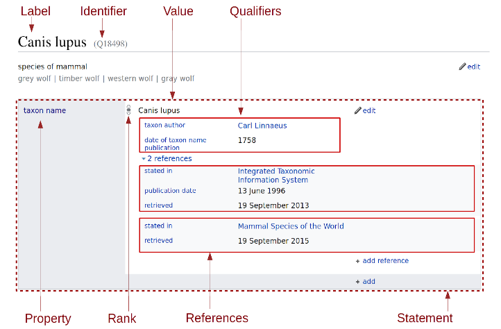

# Usage scenario and requirements for the software mention recognizer service

## CiteSuggest

__CiteSuggest__ is referred as Prototype 1 in the Sloan proposal.

```
CiteSuggest is a tool to recommend software citations based on submitted article text or source code. Authors will be prompted to upload their Word .doc, text, or latex manuscript. We then run the manuscript through our machine learning algorithm to find software this author mentioned.
```

The first requirements for implementing such a service are:

- a software mention recognizer able to process text from different formats,

- a software disambiguation/matching component to identify from the extracted software information a unique software entity.

```
The next step will use data from a module that identifies the preferred citation using available data.
```

For supporting such requirement, we need:

- a database of software entities,

- in the database, storing association of the best reference source for each software entity; this best reference source will be used to generate the best formal citation of the software,

- mechanism for identifying the best reference source for each software entity.

```
In addition to suggesting best-practice citations based on existing software mentions in papers, we’ll attempt to identify related software that the author may have neglected to mention at all
```

As additional services required for the above feature:

- a software entity similarity measure,

- ability to request the most relevant softwares, ranked according to the similarity measure based on an input which could be one or several software mentions, software entities and/or textual contexts. 


Code/script can also alternatively been submited by an author/user, and used software will be identified based on the library/package dependencies. Similarly for these identified software, prefered citations will be made available. 

As additional requirements: 

- ability to extract software dependencies from given software sources,

- ability to match software packages as declared in the dependency management system (e.g. PyPI, CRAN, NPM, maven central) with software entities stored in the software knowledge base, which require again some adapted disambiguation.


## CiteMeAs for GitHub 

__CiteMeAs for GitHub__ is referred as Prototype 2 in the  Sloan proposal.


```
CiteAs for GitHub will help software projects on GitHub make clear requests for their preferred citations.
```

The idea is to automatically submit pull requests to GitHub repos with an updated README containing a preferred/normalized citation.  

Note that the proposed feature might be assimilated to automatic PR / bot which is banned on GitHub (even if the bot is nice!). Such a feature would need an opt-in from the project administrators, basically being a GitHub App requesting some permissions. So we do not think that the described feature is feasable and the prototype based on an opt-in step of the project developers do not make a lot of sense. 

## Software Impactstory

__Software Impactstory__ is referred as Prototype 3 in the  Sloan proposal.

```
Software Impactstory is an interface to help scholars that contribute software to  identify their software impact in existing literature.
```

The objective is to identify all of a user’s software products and papers related to those products.

Note that such a tool might be conflicting with GDPR, European users having developed softwares have not given their explicit consent for being part of a database of software authors and for profiling mechanisms. GDPR applies to European citizens wherever a system is operating.  

The described features would imply as additional requirements:

- data model and storage for software authors

- author disambiguation mechanisms, note that author names in bibliographical references can be difficult to disambiguate because they usually come with less information (e.g. only initials) than author names in the header of an article (more often full name with affiliation)

- author identification mechanisms for software repository: For a repo, the name of an author is rarely explicit, it is often necessary to analyse profile information, emails or the readme for finding a bibliographical reference for instance (which might be inline, not in a specific bibliographical section as for scholar papers), and then parse this reference string. 


## Requirement analysis for Software Knowledge Base

### Need for software mention disambiguation

Storing the list of software mentions in the scientific litterature and their mention contexts are not enough for supporting the above scenarios. We need to conflate the mentions at an aggregated software entity level, so that if the same software is refered using different wording, we can identify this unique software in the two contexts (of course the software version might differ). Software naming might not be very ambiguous (few polysemy), but synonymy might be important (same software with different equivalent naming). 

### Need for a software knowledge base and an entity scheme

The software knwoledge base will be capable of storing entity information at general level and at version level. Boths level can be associated with mentions in scientific papers. 

Although we would in theory only need to store the attributes that can be extracted from the mention recognizer, so the attributes that are annotated in the training corpus (software name, author, version date, version numebr and url), storing more information is useful for disambiguation because it can be used to match more context information.  

### Need for software entity similarity / recommendation

The goal is from a given publication, find the related softwares not mentioned. 


### Determining best citable sources

Simple heuristics can be envisaged (document most cited when mentioning the software, document with the highest number of mentions of the software). 

Normally, this task would require the creation of an evaluation dataset to measure the performance of a proposed solution. Ideally training data would need to be available. One approach would be to enrich the gold corpus by indicating for each software mention if the current article (where the mention occurs) is the best citation for the software, to identify possible citations accompanying the software mention and if the citation can be considered as the best citation for the software. 


### Software dependencies as additional layer of relations in the KB

Depsy covers already Python and R / PyPI and CRAN (11,223 software packages).

As a general source of information, one of the challenges is the variety of dependency management systems. Each programing language comes usually with its own dependency management systems. One progamming language can have several depedency management systems (like Java with _ant_, _maven_ and _gradle_ or C++ with _make_, _cmake_, etc.). Cross-language dependencies can be handled too, for instance with _swig_.

A second difficulty is to match unambiguously a software based on the metadata and information provided in a package or a repo, with the software entity in a knowledge base. 

## Software Knowledge Base

We explore in the section the usage of Wikidata as Knowledge Base. 

### Discussion

The advantages for using Wikidata as data scheme are multiple:

- an already existing extensive scheme with 82,303 software instances and sub-classes, which would seed the Impactstory software database,

- a lot of links and textual content via Wikipedia that can be used for text and graph-based disambiguation and/or entity embeddings,

- it is scaling: Wikidata schema representation scales to millions of entities and hundred million of statements, resolving most of the blocking and ugly issues of the Semantic Web paradigm based on Description Logics,

- open data (CC-0) with open source tool supporting collaborative work between humans and machines,

- perspectives to contribute to Wikidata for the benefit of the public,

- possibility to use existing disambiguation tools, in particular our own implementation [entity-fishing](https://github.com/kermitt2/entity-fishing).

As drawback, we could mention that the data scheme is graph-oriented and cannot be "natively" supported at low level by a relational database (like MySQL, although the data is actually stored by Wikimedia with MySQL, but it's blob flat representation), nor by a document database (e.g. Mongo DB) without the creation of additional indexes. However this is not a practical issue and using Mongo DB as data storage is straightforward. 

Regarding the usage of entity-fishing as a disambiguation tool:

- it's already implemented, used in production by several publishers and well-maintained,

- it works well for both text-based input and structured data input,

- it's generic, it could be rused for other scientific entities in the future (it does not require any customisation with explicit software attributes which would impact re-using the system to other type of entities)

- already built on top of wikidata.

As drawback, the current version of entity-fishing will likely not scale the processing of 12 million documents. It will require to adapt it for that performance level. The current version is designed to disambiguate all the document content and it would be simply necessary to limit the process to the context around the software mentions. 

The second drawback is that entity-fishing is a relatively heavy to install because its knowledge base contains all Wikidata content, plus at least the English Wikipedia in a an efficient compiled graph representation, representing a volume of ~ 50GB of data when uncompressed. 

## Data scheme for software entity

### Identifier

Each software entity has a unique identifier:

- Wikidata identifier for software entities already in Wikidata, e.g. Q8029 for BibTeX

- Identifier for software entities not in Wikidata: E24 for GROBID (we basically simply replace Q by E - for External, but keep the same data model)


### Data scheme

#### Summary of Wikidata data scheme



The Wikidata data scheme corresponds to the following set of information for each _item_ (entity). Note that we are reusing the json notation of the json Wikidata REST API: 

- unique identifier

```json
    "id": "Q8029",
```

- a set of labels, one label for each language, corresponding to the _preferred term_ used to reference an entity. 

```json
    "labels": {"en": {"language": "en", "value": "BibTeX"}, "fr": {"language": "fr", "value": "BibTeX"}}, 
```

- a set of natural language descriptions, one for each language:

```json
    "descriptions": {"en": {"language": "en", "value": "reference management software for formatting lists of references"}},
```

- a set of alias, which are synonyms to reference the entity, in different languages

- a set of claims, each claims being a proposition associated to a property for characterizing the entity. The property is introduced by a prefix P. The value of the claim is defined by a type and a a datavalue structure as illustrated bellow:

```json
    "claims": {"P31": [{"datatype":"wikibase-item", "datavalue": {"value": "Q7397"}},      /** instance of software */
                       {"datatype":"wikibase-item", "datavalue": {"value": "Q18616720"}}], /** instance of bibliographic data format */
               "P178": [{"datatype":"wikibase-item", "datavalue": {"value": "Q93068"}}],   /** developer is Q93068 (Oren Patashnik) */
               "P856": [{"datatype":"url", "datavalue": {"value": "https://www.ctan.org/pkg/bibtex"}}] /** url */
              }
```

A complete json example:

```json
{
    "id": "Q8029",
    "labels": {"en": {"language": "en", "value": "BibTeX"}}, 
    "descriptions": {"en": {"language": "en", "value": "reference management software for formatting lists of references"}},
    "aliases": [],
    "claims": {"P31": [{"datatype":"wikibase-item", "datavalue": {"value": "Q7397"}},      /** instance of software */
                       {"datatype":"wikibase-item", "datavalue": {"value": "Q18616720"}}], /** instance of bibliographic data format */
               "P178": [{"datatype":"wikibase-item", "datavalue": {"value": "Q93068"}}],   /** developer is Q93068 (Oren Patashnik) */
               "P856": [{"datatype":"url", "datavalue": {"value": "https://www.ctan.org/pkg/bibtex"}}] /** url */
              }
}

```


#### Extension for PDF annotations 

We keep track of the position of the software mentions in the various citing documents as follow. 

Mentions information are directly produced by the software mention recognizer. The document is identified by its DOI, an URL to a particular PDF version and a sha1 for ensuring PDF integrity (coordinates depend on a particular PDF). The disambiguated software entity, if present, is simply indicated by its identifier associated to a disambiguisation confidence score. 


```json

citations: [ {
    "document": { "doi": "https://doi.org/10.1093/pcp/pcg126", 
                  "url": "",
                  "sha1": ""},
    "mentions": [{
        "type": "software",
        "id": "Q8029",
        "confidence": 0.9511,
        "software-name": {
            "rawForm": "ImagePro Plus",
            "offsetStart": 351,
            "offsetEnd": 364,
            "boundingBoxes": [{
                "p": 8,
                "x": 118.928,
                "y": 461.363,
                "w": 49.98600000000002,
                "h": 7.749360000000024
            }]
        },
        "creator": {
            "rawForm": "Media Cybernetics, Silver Spring, \nU.S.A.",
            "offsetStart": 366,
            "offsetEnd": 407,
            "boundingBoxes": [{
                "p": 8,
                "x": 175.37953333333334,
                "y": 461.363,
                "w": 115.15626666666665,
                "h": 7.749360000000024
            }, {
                "p": 8,
                "x": 48.5996,
                "y": 471.623,
                "w": 21.192299999999996,
                "h": 7.749360000000024
            }]
        }
        }],
    }
]


```


### Disambiguation process

...


## REST API for the software KB

### Response status codes

For all services, the response status codes will be as follow:

|     HTTP Status code |   reason                                               |
|---                   |---                                                     |
|         200          |     Successful operation.                              |
|         204          |     Process was completed, but no content could be extracted and structured |
|         400          |     Wrong request, missing parameters, missing header  |
|         404          |     Indicates service/property was not found           |
|         406          |     The language is not supported                      |
|         500          |     Indicate an internal service error, further described by a provided message           |


### Retrieve information about a software entity in the KB

Endpoint: `/api/concept/{id}`

|   method  |  response type      | 
|---        |---                  |
| GET       |   application/json  |

Parameters:

|requirement |   name  |  content-type value   |  description |
|---         |---      |---                    |---                        |
|required    |   id    |  String               |  Software identifer in the databse  |

Example: 

> curl localhost:8070/api/concept/Q8029


```json
{
    "id": "Q8029",
    "labels": {"en": {"language": "en", "value": "BibTeX"}}, 
    "descriptions": {"en": {"language": "en", "value": "reference management software for formatting lists of references"}},
    "aliases": [],
    "claims": {"P31": [{"datatype":"wikibase-item", "datavalue": {"value": "Q7397"}},      /** instance of software */
                       {"datatype":"wikibase-item", "datavalue": {"value": "Q18616720"}}], /** instance of bibliographic data format */
               "P178": [{"datatype":"wikibase-item", "datavalue": {"value": "Q93068"}}],   /** developer is Q93068 (Oren Patashnik) */
               "P856": [{"datatype":"url", "datavalue": {"value": "https://www.ctan.org/pkg/bibtex"}}] /** url */
              }
}

```

Note by default the citations information (with in particular location of the software mentions in the different citing PDF) are not present in the response to this query, accessing this information requires a separate call to the following service. 

### Retrieve citation information for a software entity

Endpoint: `/api/concept/{id}/citations`

|   method  |  response type      | 
|---        |---                  |
| GET       |   application/json  |

Parameters:

|requirement |   name  |  content-type value   |  description |
|---         |---      |---                    |---                        |
|required    |   id    |  String               |  Software identifer in the databse  |

Example: 

> curl localhost:8070/api/concept/Q8029/citations

```json
{
    "id": "Q8029",
    "citations": [ {
        "document": { "doi": "https://doi.org/10.1093/pcp/pcg126", 
                      "url": "",
                      "sha1": ""},
        "mentions": [{
            "type": "software",
            "id": "Q8029",
            "confidence": 0.9511,
            "software-name": {
                "rawForm": "bibtex",
                "offsetStart": 351,
                "offsetEnd": 364,
                "boundingBoxes": [{
                    "p": 8,
                    "x": 118.928,
                    "y": 461.363,
                    "w": 49.98600000000002,
                    "h": 7.749360000000024
                }]
            },
            "creator": {
                "rawForm": "O. Patashnik",
                "offsetStart": 366,
                "offsetEnd": 407,
                "boundingBoxes": [{
                    "p": 8,
                    "x": 175.37953333333334,
                    "y": 461.363,
                    "w": 115.15626666666665,
                    "h": 7.749360000000024
                }, {
                    "p": 8,
                    "x": 48.5996,
                    "y": 471.623,
                    "w": 21.192299999999996,
                    "h": 7.749360000000024
                }]
            }
        }]
    }, 
    {
        "document": { "doi": "", 
                      "url": "",
                      "sha1": ""},
        "mentions": [{
            "type": "software",
            "id": "Q8029",
            "confidence": 0.7719,
            "software-name": {
            "rawForm": "BibTeX",
            "offsetStart": 113,
            "offsetEnd": 135,
            "boundingBoxes": [{
                "p": 8,
                "x": 271.854,
                "y": 363.347,
                "w": 125.13299999999998,
                "h": 13.283999999999992
            }]
        },
        }]
    }
    ]

}
```

### Disambiguate a software mention in isolation

Endpoint: `/api/disambiguate`

|   method  |  response type      | 
|---        |---                  |
| POST      |   application/json  |          

Parameters:

|requirement |   name  |  content-type value   |  description |
|---         |---      |---                    |---                                                         |
|required    |   json  |  multipart/form-data  |  Description of the mention and its context in JSON UTF-8  |

The `json` parameter provides information about the software mention (in a format similar as mention annotation), and an optional contextual text.

Example: 

> curl -X POST localhost:8070/api/disambiguate --form "json={'mentions':[{'type':'software','software-name':{'rawForm':'bibtex'},'creator':{'rawForm':'O. Patashnik'}}]}" 

Example of the json parameter with textual context:

```json
{
    "mentions": [{
        "type": "software",
        "software-name": {
            "rawForm": "bibtex"
        },
        "creator": {
            "rawForm": "O. Patashnik",
        }
    }],
    "context": "LaTeX, originally written by Leslie Lamport, is a document preparation system. BibTex developed by O. Patashnik is its reference management component. "
}
```

The response will complement the input with disambiguated software entity `id` and a disambiguation confidence score. 

```json
{
    "mentions": [{
        "type": "software",
        "id": "Q8029",
        "confidence": 1.0,
        "software-name": {
            "rawForm": "bibtex"
        },
        "creator": {
            "rawForm": "O. Patashnik",
        }
    }],
    "context": "LaTeX, originally written by Leslie Lamport, is a document preparation system. BibTex developed by O. Patashnik is its reference management component. "
}
```

### Extract all raw mention of a software in a PDF

Endpoint: `/api/softwares/mentions`

|   method  |  response type      | 
|---        |---                  |
| POST      |   application/json  |   


Parameters:


|requirement |   name  |  content-type value   |  description |
|---         |---      |---                    |---                        |
|required    |   file  |  multipart/form-data  |  PDF file (as multipart)  |


The response will list the extracted mentions similarly as the current software mention module with PDF coordinate information for each text chunk. The dimentions of each page of the document are also provided, in case the client needs to display the annotations in the PDF with the given coordinates: 

```json
{
    "mentions": [{
        "type": "software",
        "software-name": {
            "rawForm": "ImagePro Plus",
            "offsetStart": 351,
            "offsetEnd": 364,
            "boundingBoxes": [{
                "p": 8,
                "x": 118.928,
                "y": 461.363,
                "w": 49.98600000000002,
                "h": 7.749360000000024
            }]
        },
        "creator": {
            "rawForm": "Media Cybernetics, Silver Spring, \nU.S.A.",
            "offsetStart": 366,
            "offsetEnd": 407,
            "boundingBoxes": [{
                "p": 8,
                "x": 175.37953333333334,
                "y": 461.363,
                "w": 115.15626666666665,
                "h": 7.749360000000024
            }, {
                "p": 8,
                "x": 48.5996,
                "y": 471.623,
                "w": 21.192299999999996,
                "h": 7.749360000000024
            }]
        }
        }],
    "pages": [ {"page_height":842.0, "page_width":595.0}, {"page_height":842.0, "page_width":595.0}, ...]
}
```

Example:

> curl --form file=@./thefile.pdf localhost:8070/api/softwares/mentions


### Extract all disambiguated software entities in a PDF

Endpoint: `/api/softwares/entities`

|   method  |  response type      | 
|---        |---                  |
| POST      |   application/json  |   


Parameters:

|requirement |   name  |  content-type value   |  description |
|---         |---      |---                    |---                        |
|required    |   file  |  multipart/form-data  |  PDF file (as multipart)  |

The response response if similar to the previous mention extraction service, but the mention are disdambiguated against the software database, with disambiguated software entity `id` and a disambiguation confidence score. Non-disambiguated mentions are not appearing. 

```json
{
    "mentions": [{
        "type": "software",
        "id": "E280",
        "confidence": 0.7130,
        "software-name": {
            "rawForm": "ImagePro Plus",
            "offsetStart": 351,
            "offsetEnd": 364,
            "boundingBoxes": [{
                "p": 8,
                "x": 118.928,
                "y": 461.363,
                "w": 49.98600000000002,
                "h": 7.749360000000024
            }]
        },
        "creator": {
            "rawForm": "Media Cybernetics, Silver Spring, \nU.S.A.",
            "offsetStart": 366,
            "offsetEnd": 407,
            "boundingBoxes": [{
                "p": 8,
                "x": 175.37953333333334,
                "y": 461.363,
                "w": 115.15626666666665,
                "h": 7.749360000000024
            }, {
                "p": 8,
                "x": 48.5996,
                "y": 471.623,
                "w": 21.192299999999996,
                "h": 7.749360000000024
            }]
        }
        }],
    "pages": [ {"page_height":842.0, "page_width":595.0}, {"page_height":842.0, "page_width":595.0}, ...]
}
```

Example:

> curl --form file=@./thefile.pdf localhost:8070/api/softwares/entities


### Provide the n-best citations for a software entity

Endpoint: `/api/{id}/citations/nbest`

|   method  |  response type      | 
|---        |---                  |
| GET       |   application/json  |

Parameters:

|requirement |   name  |  content-type value   |  description |
|---         |---      |---                    |---                        |
|required    |   id    |  String               |  Software identifer in the databse  |
|optional    |   n     |  Integer              |  number of related software entity to return (ranked), default is 1   |

Example: 

> curl localhost:8070/api/Q8029/citations/nbest -d 'n=2'

The response lists the top citing documents with a relevance score, ranked in a decreasing order:

```json
{
    "id": "Q8029",
    "citations": [ 
    {
        "document": { "doi": "https://doi.org/10.1093/pcp/pcg126", 
                      "url": "",
                      "sha1": ""},
        "relevance": 0.95
    },
    {
        "document": { "doi": "https://doi.org/10.1038/s41699-018-0076-0", 
                      "url": "",
                      "sha1": ""},
        "relevance": 0.89
    }
    ]
}
```

### Provide the n most related software entities for a given software entity

Endpoint: `/api/{id}/related`

|   method  |  response type      | 
|---        |---                  |
| GET       |   application/json  |

Parameters:

|requirement |   name  |  content-type value   |  description |
|---         |---      |---                    |---                        |
|required    |   id    |  String               |  Software identifer in the databse  |
|optional    |   n     |  Integer              |  number of related software entities to return (ranked), default is 1   |


Example: 

> curl localhost:8070/api/Q8029/related -d 'n=2'

The response lists the top software entities with a relatedness score, ranked in a decreasing order:


```json
{
    "id": "Q8029",
    "entities": [ 
    {
        "id": "Q5310",
        "relatedness": 0.98
    },
    {
        "id": "Q226915",
        "relatedness": 0.80
    }
    ]
}
```

### Provide the n most relevant related software entities for a PDF

Endpoint: `/api/softwares/related`

|   method  |  response type      | 
|---        |---                  |
| POST      |   application/json  |


Parameters:

|requirement |   name  |  content-type value   |  description |
|---         |---      |---                    |---                        |
|required    |   file  |  multipart/form-data  |  PDF file (as multipart)  |
|optional    |   n     |  multipart/form-data  |  number of related software entities to return (ranked), default is 1   |


Example:

> curl --form file=@./thefile.pdf localhost:8070/api/softwares/mentions --form n=2

The response lists the top software entities with a relatedness score, ranked in a decreasing order:


```json
{
    "entities": [ 
    {
        "id": "Q5310",
        "relatedness": 0.62
    },
    {
        "id": "Q226915",
        "relatedness": 0.49
    }
    ]
}
```